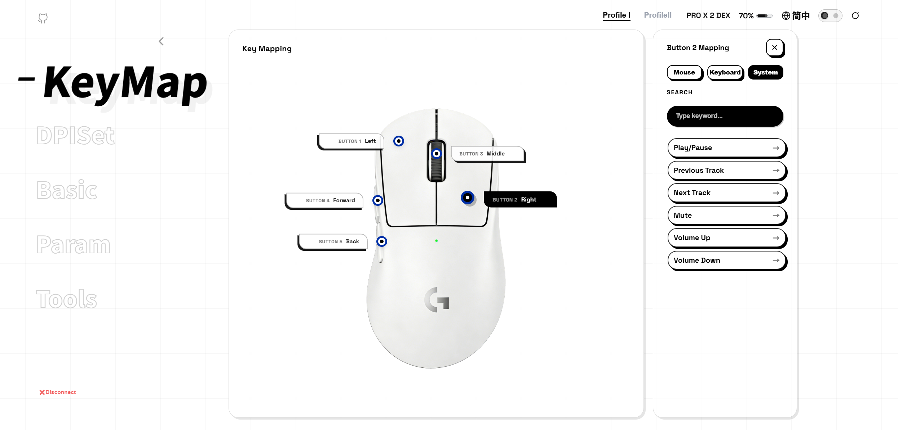
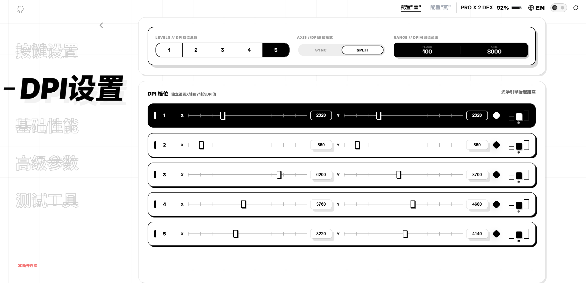
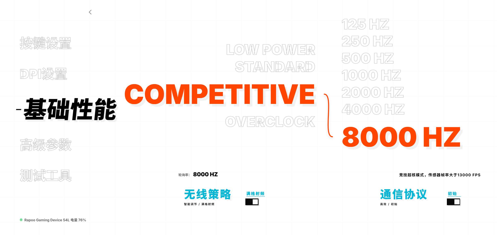
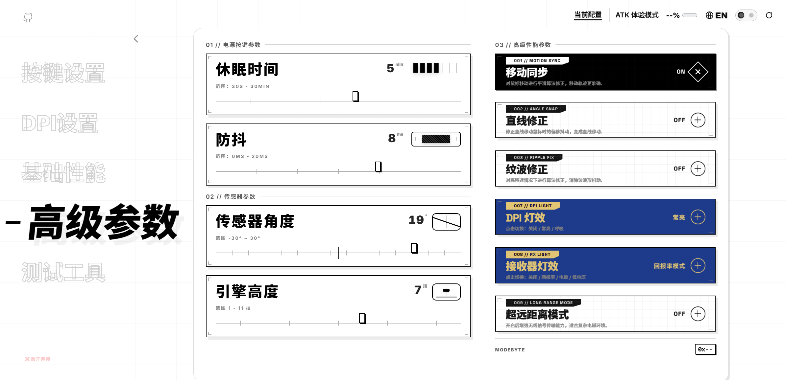
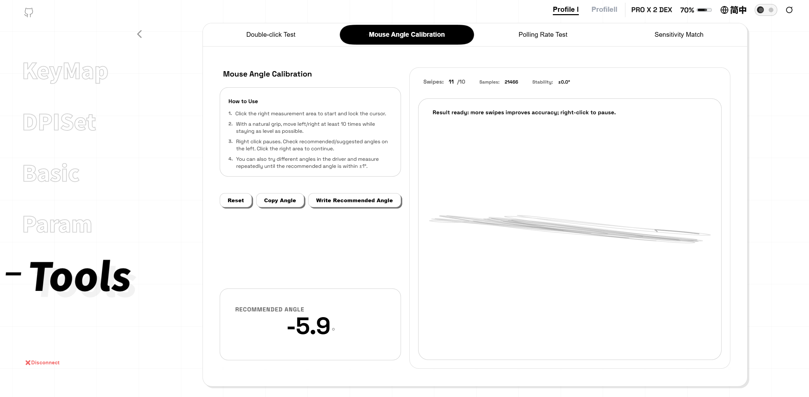

# Click Sync


[English](#english) | [简体中文](#简体中文)

---

## English

Click Sync is a WebHID-based multi-brand mouse web driver console. Its goal is to unify the configuration capabilities of different brands into a single browser application, eliminating the need to install local driver programs.

Supported brands in the current code: `Razer`, `Logitech`, `Rapoo`, `ATK`, `Ninjutso`, `Chaos`.

### Features

- Single-page frontend application, pure static resources, no build dependencies.
- Unified read and write based on standard keys (`stdKey`), reducing brand-specific code branches.
- Automatically identifies devices at runtime and dynamically loads protocol scripts by brand.
- Supports configuration readback, incremental writing, write debouncing, and failure readback correction.
- Built-in test tools page (double-click detection, polling rate test, sensitivity matching, angle calibration).

### UI Preview







### Supported Devices & Recognition Rules (Current Source)

Device recognition logic is located in `src/core/device_runtime.js`, matched through a combination of `vendorId/productId` and `usagePage/usage`.

| Device Type | Main Recognition Criteria |
|---|---|
| Razer | `vendorId=0x1532` and `productId` in supported list (`0x00C0`-`0x00C5`) |
| Logitech | `vendorId=0x046D` and exists `usagePage=0xFF00` (`usage=0x01/0x02` or vendor collection) |
| Rapoo | `vendorId=0x24AE` and exists `usagePage=0xFF00`, `usage=14/15` |
| ATK | `vendorId in {0x373B,0x3710}` and exists `usagePage=0xFF02`, `usage=0x0002` |
| Ninjutso | `vendorId=0x093A`, `productId=0xEB02`, and `productName` must be `ninjutso sora v3` (case-insensitive) |
| Chaos | `vendorId=0x1915` and exists `usagePage=0xFF0A` or `0xFF00` |

Razer built-in models in current protocol (`src/protocols/protocol_api_razer.js`):
- Razer Viper V3 Pro (Wired/Wireless)
- Razer DeathAdder V3 Pro (Wired Alt/Wireless Alt)
- Razer DeathAdder V3 HyperSpeed (Wired/Wireless)

Chaos built-in model mappings (`src/protocols/protocol_api_chaos.js`):
- CHAOS M1 / M1 PRO / M2 PRO / M3 PRO (Wired, Wireless 1K, Wireless 8K variants)

### Feature Overview

The following features are driven by standard keys and capability switches in `src/refactor/refactor.core.js` + `src/refactor/refactor.profiles.js`. The UI will automatically show/hide them based on device capabilities.

#### General Features
- Key Mapping (Button action configuration)
- DPI stages, current stage, X/Y axis DPI (if supported by device)
- Polling Rate
- Sleep time, Debounce time
- Performance mode (e.g., `low/hp/sport/oc`)
- Angle and sensor-related parameters (if supported by device)
- Battery and firmware information display (provided according to protocol capabilities)

#### Typical Device-Specific Capabilities (Based on current profile)
- **Razer**: Dynamic Sensitivity, Smart Tracking (mode, level, Lift/Landing distance), Hyperpolling Indicator (certain models), Low battery threshold parameters.
- **Logitech**: Profile Slot switching, Independent wired/wireless polling rates, Onboard Memory mode, LIGHTFORCE switch mode, Surface Mode, BHOP Delay.
- **ATK**: Long Range Mode, DPI lighting loop, Receiver lighting loop, DPI color.
- **Ninjutso**: Burst / Hyper Click / LED Master, MARA/Static lighting effects, Static light color, LED brightness/speed parameters.

*Note: The actual writable capabilities are ultimately determined by the device firmware and protocol layer returns.*

### Page Structure

Main functional page (`index.html`):
- `#keys`: Key settings
- `#dpi`: DPI settings
- `#basic`: Basic performance
- `#advanced`: Advanced parameters
- `#testtools`: Test tools

Test tools subpages (`src/tools/*.js`):
- Double-click detection (`pageMain`)
- Mouse angle calibration (`pageRot`)
- Polling rate test (`pagePoll`)
- Sensitivity matching (`pageMatch`)

### Browser Requirements

- **Recommended**: Desktop Chromium-based browsers (Chrome / Edge, etc.)
- **Must be in a secure context**: `https://` or `http://localhost`
- Opening directly via `file://` usually does not support WebHID.
- The initial connection must be triggered by a user gesture, and the device must be authorized in the browser popup.

### Quick Start

This project is a pure frontend static site. You can start it directly with a local static server.

```bash
# Method 1: Python
python -m http.server 8000

# Method 2: Node.js (requires Node installed)
npx http-server . -p 8000
